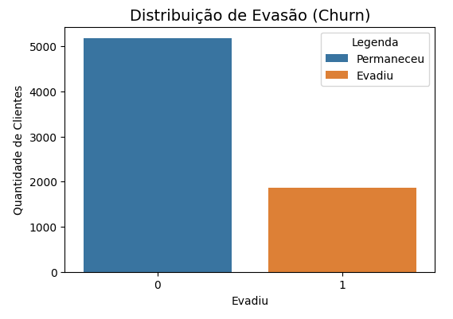
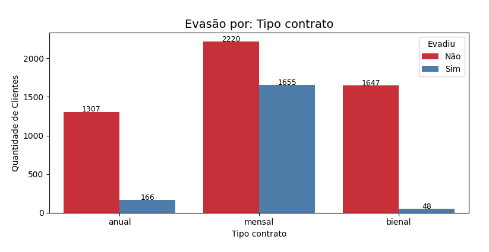
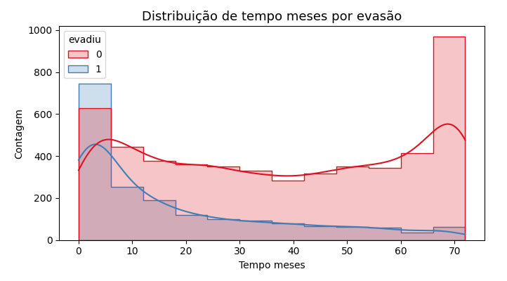
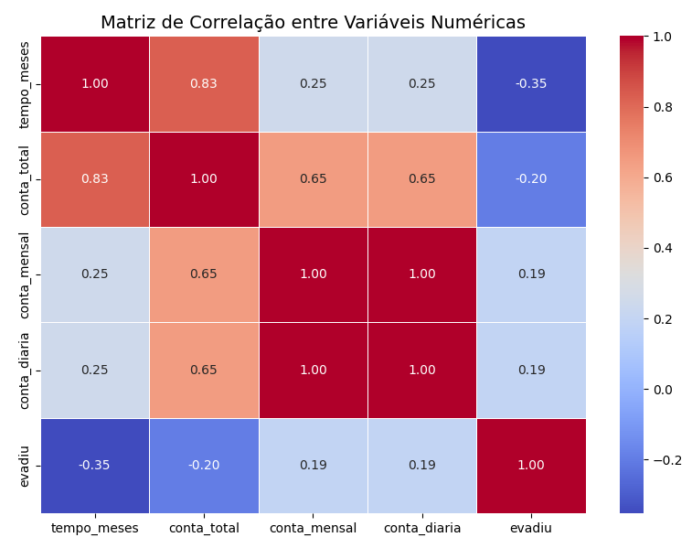

# 📊 TelecomX – Análise de Evasão de Clientes (Churn)

## 🧠 Descrição do Projeto

A **TelecomX** enfrenta um desafio crítico: o alto índice de evasão (churn) de clientes. Este projeto tem como objetivo identificar os principais fatores que levam ao cancelamento dos serviços e apoiar estratégias de retenção com base em dados. 

A análise foi realizada com foco em variáveis comportamentais, financeiras e contratuais, permitindo extrair **insights estratégicos** sobre o comportamento dos clientes.

---

## 🎯 Objetivos

- Identificar padrões e tendências de evasão.
- Explorar variáveis categóricas e numéricas relacionadas ao churn.
- Limpar e transformar dados brutos em informações úteis.
- Visualizar insights de forma clara com gráficos.
- Oferecer recomendações práticas para retenção de clientes.

---

## 📦 Etapas do Projeto

### 1. Coleta de Dados

- **Fonte**: API pública no formato JSON
- **Link da API**: [TelecomX_Data.json](https://raw.githubusercontent.com/ingridcristh/challenge2-data-science/refs/heads/main/TelecomX_Data.json)

### 2. Limpeza e Transformação

- Normalização de dados aninhados (`pd.json_normalize`)
- Conversão de tipos (e.g., `Charges.Total` → float)
- Tratamento de valores ausentes e espaços em branco
- Remoção de inconsistências e padronização de texto
- Criação da variável `conta_diaria` e renomeação para o português
- Transformação de colunas binárias (`sim/não`) em valores 0 e 1

---

## 📊 Análise Exploratória (EDA)

### 🔍 Distribuição de Evasão

- Aproximadamente **27% dos clientes evadiram**.
- Os gráficos foram rotulados com legendas (0 = permaneceu, 1 = evadiu).

---

### 🔍 Evasão por Variáveis Categóricas

Exemplo: Tipo de Contrato

- **Contratos mensais** possuem maior taxa de evasão.
- Padrões semelhantes foram observados nas análises de **forma de pagamento** e **quantidade de serviços contratados.**

---

### 🔍 Evasão por Variáveis Numéricas

Exemplo: Tempo de Contrato vs Evasão

- Clientes com **menor tempo de permanência** tendem a **evadir mais.**
- A maior parte dos evadidos possui menos de 10 meses como cliente.

---

### 🔍 Correlação com Evasão

- Correlação **negativa** entre `tempo_meses` e `evadiu`: **clientes com mais tempo tendem a permanecer.**
- Correlação **positiva** com `conta_diaria`: **clientes com maiores gastos diários tendem a evadir mais.**

---

## 💡 Insights Relevantes

| Fator                             | Impacto na Evasão |
|----------------------------------|--------------------|
| Contratos mensais                | Aumentam a evasão  |
| Pagamento por boleto             | Alta evasão        |
| Menor tempo de permanência       | Alta evasão        |
| Poucos serviços contratados      | Alta evasão        |
| Conta diária baixa               | Menor evasão       |

---

## 🧭 Recomendações Estratégicas

- Estimular **contratos de longa duração**.
- Oferecer **benefícios para quem opta por pagamento automático**.
- Criar **estratégias de onboarding** para engajar clientes com poucos serviços.
- Desenvolver **modelos preditivos** com variáveis-chave como `tempo_meses`, `qtd_serviços`, `forma_pagamento`.

---

## 💻 Como Executar

1. Acesse o [Google Colab](https://colab.research.google.com/)
2. Carregue o notebook `TelecomX_BR.ipynb`
3. Execute célula por célula para reproduzir a análise
4. Os dados são carregados automaticamente da API

📎 Notebook: [`TelecomX_BR.ipynb`](./TelecomX_BR.ipynb)

---

## 🧰 Requisitos Técnicos

- Python 3.x
- Bibliotecas:
  - `pandas`
  - `numpy`
  - `matplotlib`
  - `seaborn`
  - `json`
  - `requests`

---

## 📚 Habilidades Aplicadas

- Coleta de dados via API
- Normalização de JSON com Pandas
- ETL (Extração, Transformação e Carga)
- EDA (Análise Exploratória de Dados)
- Visualização com Matplotlib e Seaborn
- Correlação estatística e geração de variáveis
- Tomada de decisão orientada a dados

---

## 👨‍💻 Autor

Desenvolvido por [Ricardo Hamada](https://github.com/vthamada).  
Challenge 2 – Data Science
[Alura + Oracle Next Education (ONE)](https://www.oracle.com/br/education/oracle-next-education/).

📬 [LinkedIn](https://www.linkedin.com/in/vitor-hamada)
